# 🏎️ Driver Market System - Documentación Técnica

## 📋 Índice
1. [Visión General](#visión-general)
2. [Arquitectura del Sistema](#arquitectura-del-sistema)
3. [Frontend](#frontend)
4. [Backend](#backend)
5. [Flujos de Datos](#flujos-de-datos)
6. [Modelos de Datos](#modelos-de-datos)

---

## Visión General

El sistema de mercado de pilotos permite a los usuarios:
- 🆓 **Comprar agentes libres** del mercado
- 💰 **Comprar pilotos** listados por otros usuarios
- 📋 **Listar pilotos** para venta
- 🚀 **Venta rápida** al mercado (80% refund)
- ⚡ **Cláusula de buyout** para robar pilotos de otros usuarios
- 🔒 **Sistema de bloqueo** de 7 días tras compra/buyout

---

## Arquitectura del Sistema

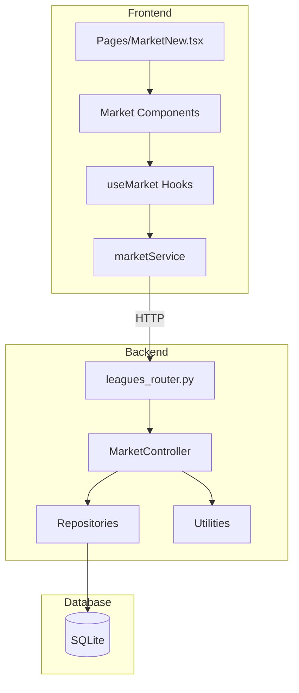

---

## Frontend

### 🎣 Hooks (`frontend/src/hooks/market/useMarket.ts`)

#### Query Hooks (GET)

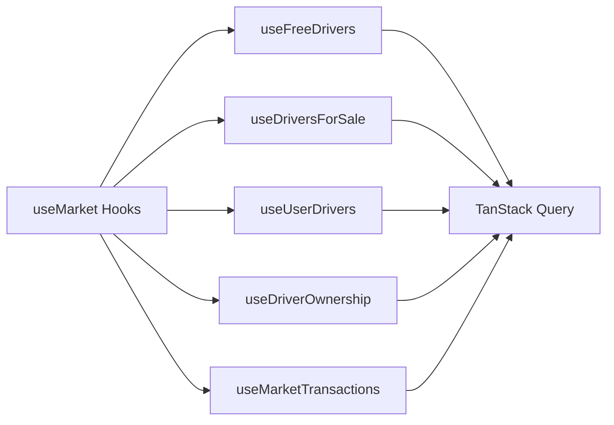

**Hooks disponibles:**

| Hook | Descripción | Query Key |
|------|-------------|-----------|
| `useFreeDrivers` | Obtiene agentes libres | `['free-drivers', leagueId]` |
| `useDriversForSale` | Obtiene pilotos en venta | `['drivers-for-sale', leagueId]` |
| `useUserDrivers` | Obtiene pilotos de un usuario | `['user-drivers', leagueId, userId]` |
| `useDriverOwnership` | Obtiene ownership de un piloto | `['driver-ownership', leagueId, driverId]` |
| `useMarketTransactions` | Historial de transacciones | `['market-transactions', leagueId]` |
| `useBuyoutHistory` | Historial de buyouts | `['buyout-history', leagueId]` |

#### Mutation Hooks (POST/PUT/DELETE)

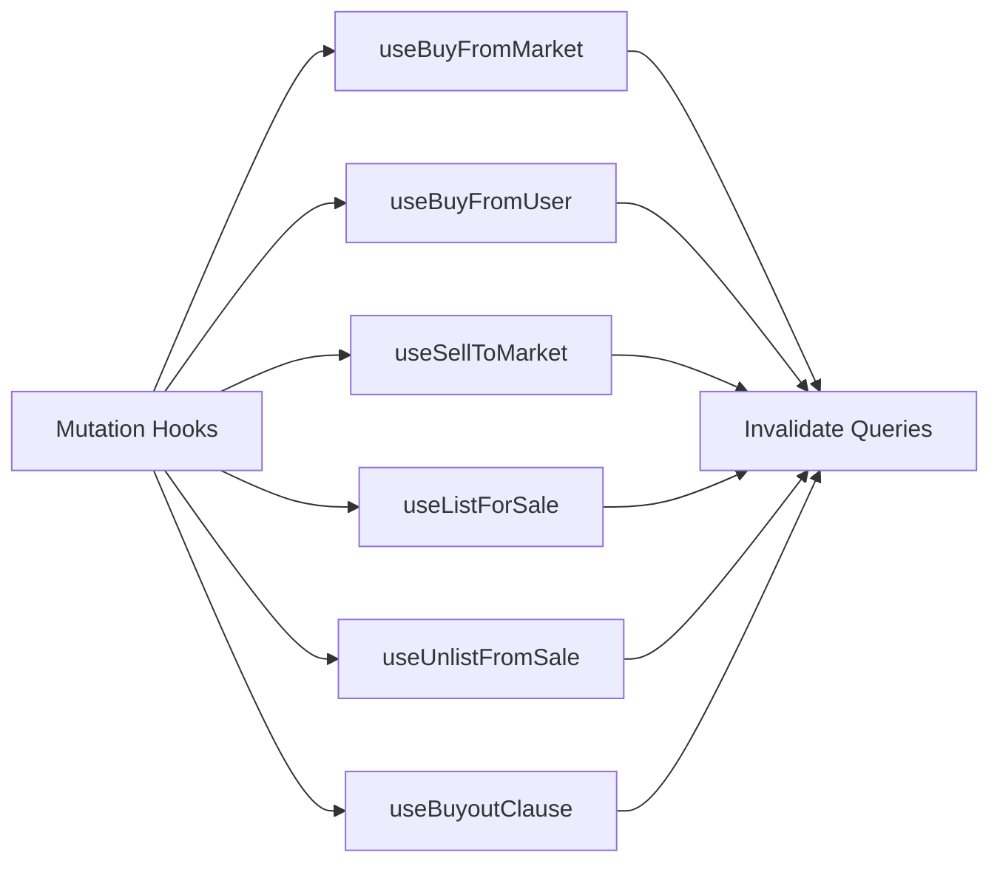

**Mutations disponibles:**

| Mutation | Descripción | Invalidaciones |
|----------|-------------|----------------|
| `useBuyFromMarket` | Comprar agente libre | free-drivers, user-drivers, user-team |
| `useBuyFromUser` | Comprar de otro usuario | drivers-for-sale, user-drivers, user-team |
| `useSellToMarket` | Venta rápida (80%) | free-drivers, user-drivers, user-team |
| `useListForSale` | Listar para venta | driver-ownerships, drivers-for-sale |
| `useUnlistFromSale` | Quitar de venta | driver-ownerships, drivers-for-sale |
| `useBuyoutClause` | Ejecutar buyout | Todas las queries del mercado |

### 📦 Servicios (`frontend/src/services/marketService.ts`)

```typescript
class MarketService {
  // GET endpoints
  getFreeDrivers(leagueId: number): Promise<DriverWithOwnership[]>
  getDriversForSale(leagueId: number): Promise<DriverWithOwnership[]>
  getUserDrivers(leagueId: number, userId: number): Promise<DriverWithOwnership[]>
  getDriverOwnership(leagueId: number, driverId: number): Promise<DriverOwnership>
  
  // POST endpoints
  buyDriverFromMarket(leagueId, driverId, request): Promise<BuyDriverResponse>
  buyDriverFromUser(leagueId, driverId, request): Promise<BuyFromUserResponse>
  sellDriverToMarket(leagueId, driverId, request): Promise<SellDriverResponse>
  listDriverForSale(leagueId, driverId, request): Promise<ListDriverResponse>
  executeBuyoutClause(leagueId, driverId, request): Promise<BuyoutClauseResponse>
  
  // DELETE endpoints
  unlistDriverFromSale(leagueId, transactionId, request): Promise<ListDriverResponse>
}
```

### 🧩 Componentes (`frontend/src/components/market/`)

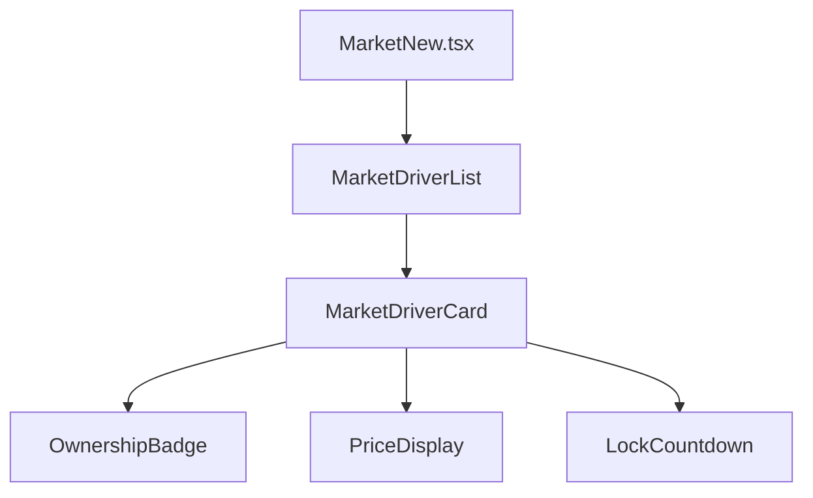

**Componentes principales:**

| Componente | Descripción |
|------------|-------------|
| `MarketNew.tsx` | Página principal del mercado |
| `MarketDriverList` | Lista de pilotos con filtros |
| `MarketDriverCard` | Card individual de piloto |
| `OwnershipBadge` | Badge de estado (Free/Listed/Owned/Locked) |
| `PriceDisplay` | Formateo de precios |
| `LockCountdown` | Countdown para desbloqueo |

### 📘 Tipos (`frontend/src/types/marketTypes.ts`)

```typescript
// Ownership
interface DriverOwnership {
  driver_id: number
  league_id: number
  owner_id: number | null  // null = free agent
  is_listed_for_sale: boolean
  acquisition_price: number
  locked_until: string | null
}

// Extended driver with ownership + stats
interface DriverWithOwnership {
  // Driver info
  id: number
  full_name: string
  team_name: string
  
  // Ownership
  owner_id: number | null
  is_listed_for_sale: boolean
  locked_until: string | null
  
  // Stats
  season_results: SeasonResults
  fantasy_stats: FantasyStats
}

// Transaction types
type TransactionType = 
  | 'buy_from_market' 
  | 'buy_from_user' 
  | 'sell_to_market' 
  | 'buyout_clause' 
  | 'emergency_assignment'
```

---

## Backend

### 🛣️ Rutas (`f1_api/routers/leagues_router.py`)

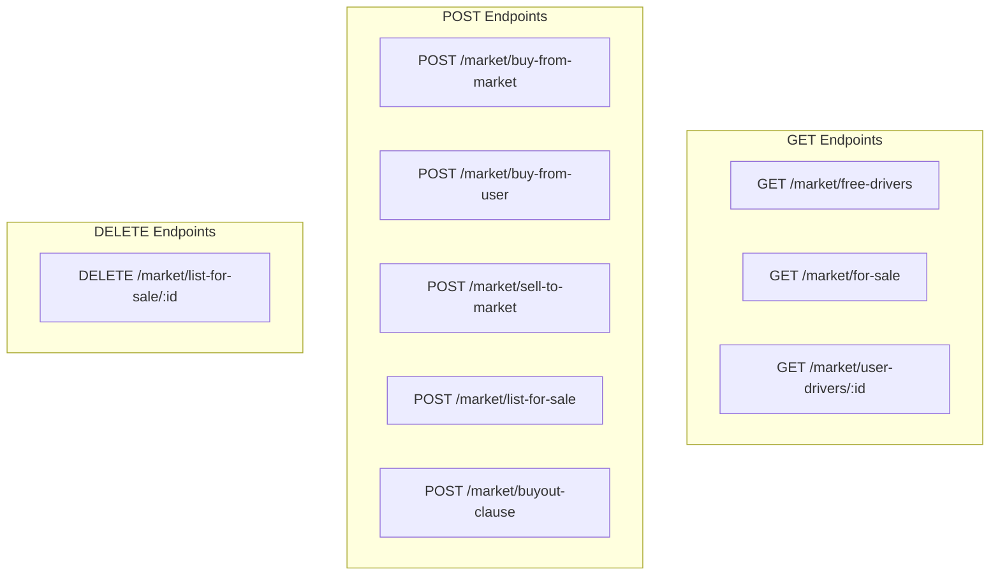

**Endpoints disponibles:**

| Método | Ruta | Descripción |
|--------|------|-------------|
| GET | `/leagues/{league_id}/market/free-drivers` | Agentes libres con stats |
| GET | `/leagues/{league_id}/market/for-sale` | Pilotos listados para venta |
| GET | `/leagues/{league_id}/market/user-drivers/{user_id}` | Pilotos de un usuario |
| POST | `/leagues/{league_id}/market/buy-from-market` | Comprar agente libre |
| POST | `/leagues/{league_id}/market/buy-from-user` | Comprar de usuario |
| POST | `/leagues/{league_id}/market/sell-to-market` | Venta rápida 80% |
| POST | `/leagues/{league_id}/market/list-for-sale` | Listar para venta |
| DELETE | `/leagues/{league_id}/market/list-for-sale/{driver_id}` | Quitar de venta |
| POST | `/leagues/{league_id}/market/buyout-clause` | Ejecutar buyout |

### 🎮 Controlador (`f1_api/controllers/market_controller.py`)

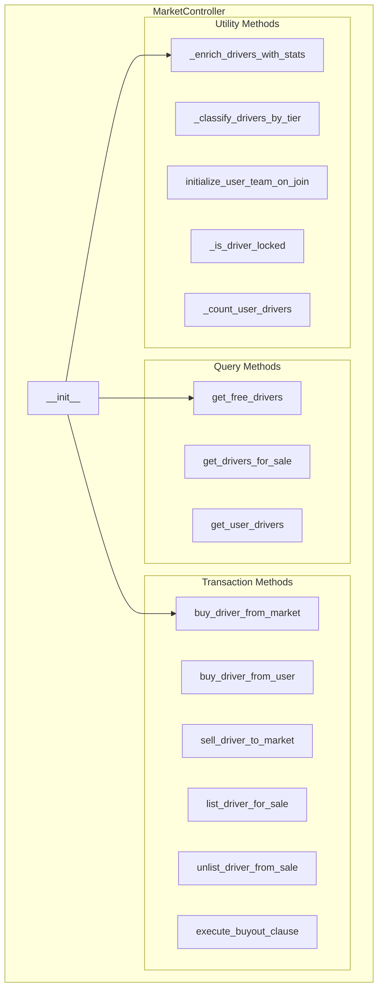

**Métodos principales:**

#### 🔍 Query Methods

| Método | Descripción | Retorno |
|--------|-------------|---------|
| `get_free_drivers()` | Obtiene agentes libres con stats enriquecidos | `List[DriverWithOwnership]` |
| `get_drivers_for_sale()` | Obtiene pilotos listados para venta | `List[DriverWithOwnership]` |
| `get_user_drivers()` | Obtiene pilotos de un usuario específico | `List[DriverWithOwnership]` |

#### 💸 Transaction Methods

| Método | Descripción | Validaciones |
|--------|-------------|--------------|
| `buy_driver_from_market()` | Compra agente libre | Budget, driver_count, ownership |
| `buy_driver_from_user()` | Compra de usuario | Budget, listed_for_sale, lock |
| `sell_driver_to_market()` | Venta rápida 80% | Ownership, not_locked, min_3_drivers |
| `list_driver_for_sale()` | Lista para venta | Ownership, not_locked, min_3_drivers |
| `unlist_driver_from_sale()` | Quita de venta | Ownership |
| `execute_buyout_clause()` | Ejecuta buyout 130% | Budget, reserve_slot, buyout_limits |

#### 🛠️ Utility Methods

| Método | Descripción |
|--------|-------------|
| `_enrich_drivers_with_stats()` | Añade season_results y fantasy_stats a drivers |
| `_classify_drivers_by_tier()` | Clasifica drivers en Tier A/B/C según puntos |
| `initialize_user_team_on_join()` | Crea team inicial con 3 Tier C drivers gratis |
| `_is_driver_locked()` | Verifica si driver está bloqueado |
| `_count_user_drivers()` | Cuenta drivers de un usuario |

**Constantes de configuración:**

```python
BUYOUT_MULTIPLIER = 1.3  # 130% del precio de adquisición
LOCK_DAYS_AFTER_PURCHASE = 7  # Días de bloqueo tras compra/buyout
SELL_TO_MARKET_REFUND = 0.8  # 80% de refund en venta rápida
MAX_BUYOUTS_PER_USER_PAIR_PER_SEASON = 2  # Máximo buyouts entre 2 usuarios
MAX_DRIVERS_PER_USER = 4  # 3 lineup + 1 reserve
CURRENT_SEASON = 2025
```

### 📊 Repositorios (`f1_api/models/repositories/`)

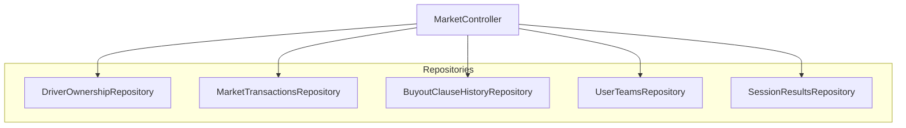

**Repositorios utilizados:**

| Repositorio | Responsabilidad |
|-------------|-----------------|
| `DriverOwnershipRepository` | CRUD de ownership, queries por liga/usuario |
| `MarketTransactionsRepository` | Historial de transacciones |
| `BuyoutClauseHistoryRepository` | Historial de buyouts |
| `UserTeamsRepository` | Teams de usuarios, actualización de budget |
| `SessionResultsRepository` | Resultados de carreras para stats |

### 🧰 Utilidades

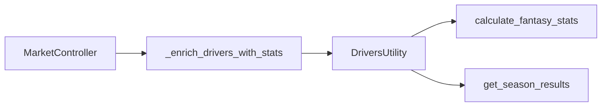

**DriversUtility** (`f1_api/models/lib/drivers_utility.py`):
- Calcula estadísticas de fantasy para cada piloto
- Genera `season_results`: puntos, poles, podios, victorias
- Genera `fantasy_stats`: avg_finish, overtake_efficiency, price

---

## Flujos de Datos

### 🆓 Flujo: Comprar Agente Libre

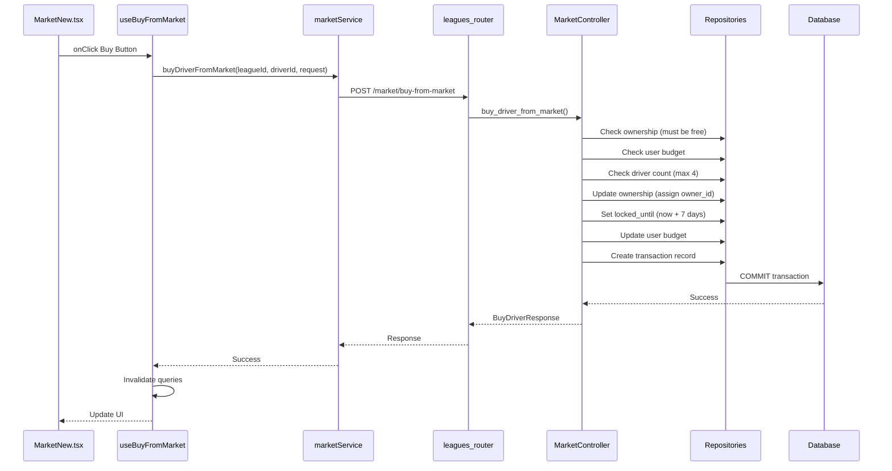

### 💰 Flujo: Comprar de Usuario

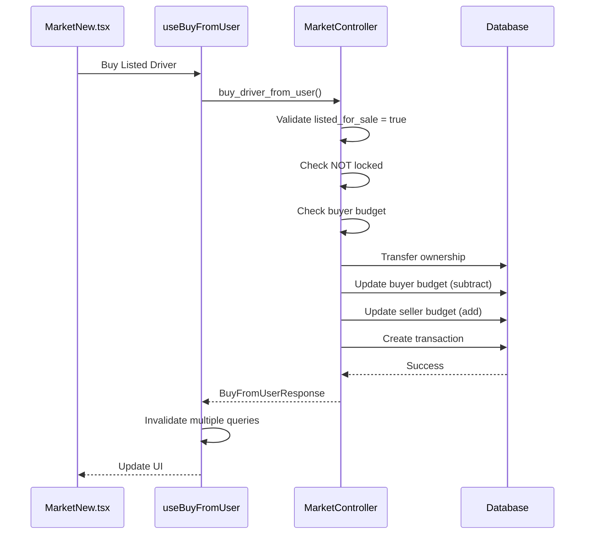

### 🚀 Flujo: Venta Rápida

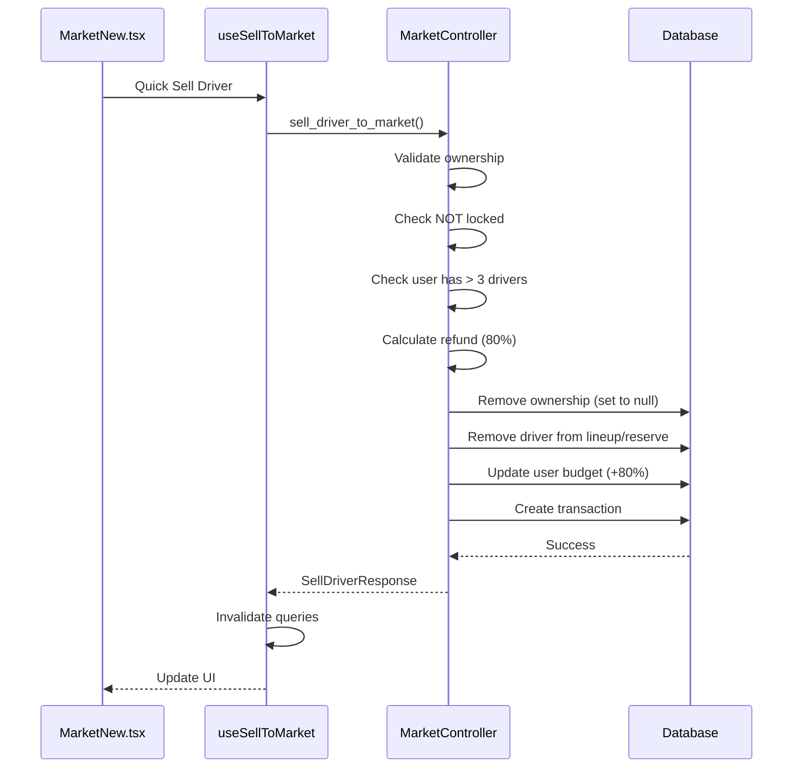

### ⚡ Flujo: Cláusula de Buyout

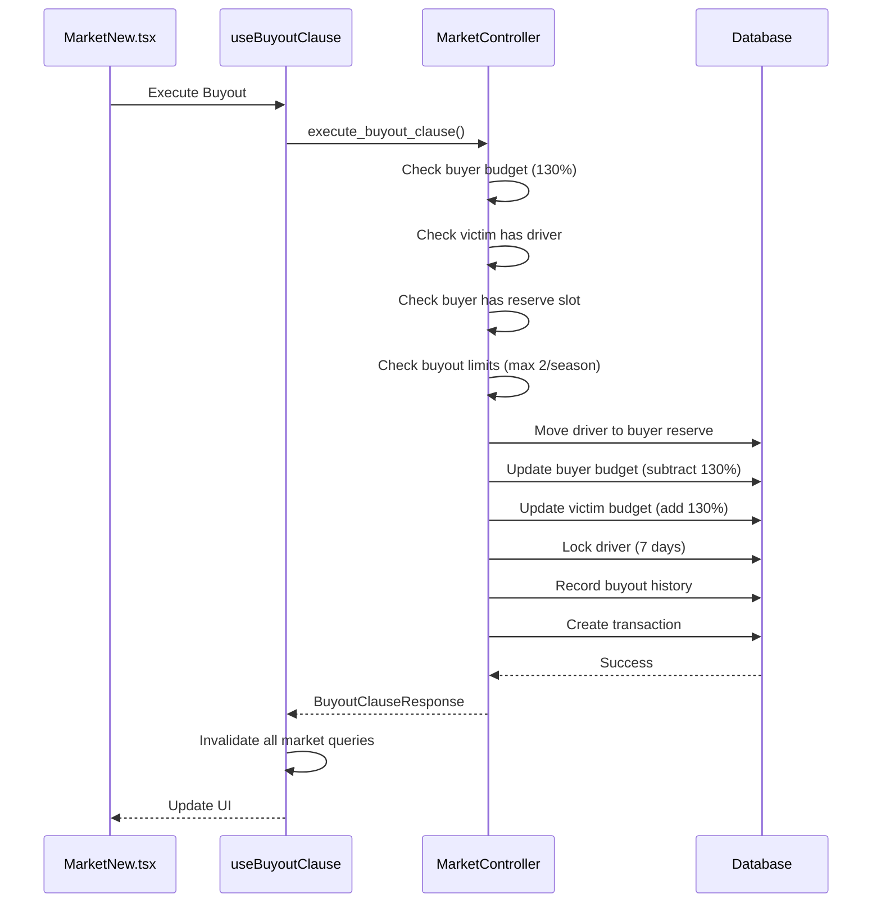

### 🎁 Flujo: Inicialización de Team

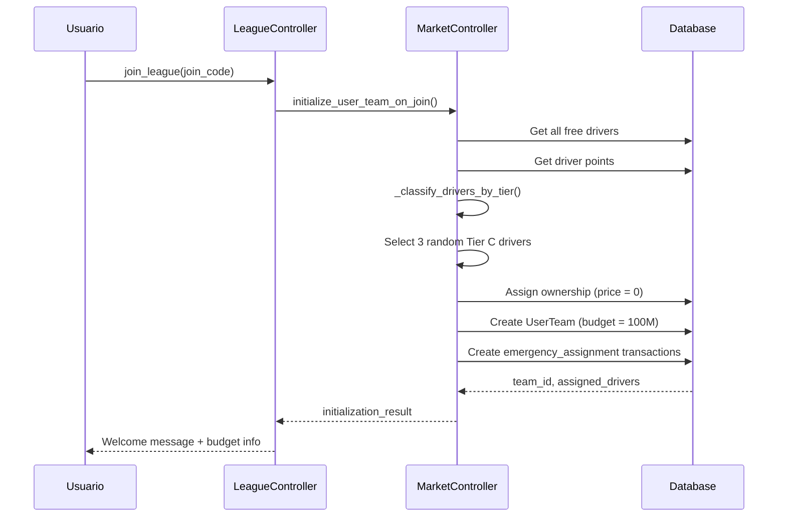

---

## Modelos de Datos

### 🗄️ Tablas Principales

#### DriverOwnership

```sql
CREATE TABLE driverownership (
  driver_id INTEGER NOT NULL,
  league_id INTEGER NOT NULL,
  owner_id INTEGER,  -- NULL = free agent
  is_listed_for_sale BOOLEAN DEFAULT 0,
  acquisition_price REAL NOT NULL,
  locked_until DATETIME,
  created_at DATETIME DEFAULT CURRENT_TIMESTAMP,
  updated_at DATETIME DEFAULT CURRENT_TIMESTAMP,
  PRIMARY KEY (driver_id, league_id)
);
```

**Estados posibles:**
- `owner_id = NULL`: Agente libre
- `owner_id != NULL, is_listed_for_sale = False`: Propiedad privada
- `owner_id != NULL, is_listed_for_sale = True`: En venta
- `locked_until > NOW()`: Bloqueado (no se puede vender/listar)

#### MarketTransactions

```sql
CREATE TABLE markettransactions (
  id INTEGER PRIMARY KEY AUTOINCREMENT,
  driver_id INTEGER NOT NULL,
  league_id INTEGER NOT NULL,
  seller_id INTEGER,  -- NULL for free agent purchases
  buyer_id INTEGER NOT NULL,
  transaction_price REAL NOT NULL,
  transaction_type VARCHAR NOT NULL,
  transaction_date DATETIME DEFAULT CURRENT_TIMESTAMP
);
```

**Transaction Types:**
- `buy_from_market`: Compra de agente libre
- `buy_from_user`: Compra de otro usuario
- `sell_to_market`: Venta rápida
- `buyout_clause`: Buyout ejecutado
- `emergency_assignment`: Asignación inicial automática

#### BuyoutClauseHistory

```sql
CREATE TABLE buyoutclausehistory (
  id INTEGER PRIMARY KEY AUTOINCREMENT,
  league_id INTEGER NOT NULL,
  buyer_id INTEGER NOT NULL,
  victim_id INTEGER NOT NULL,
  driver_id INTEGER NOT NULL,
  buyout_price REAL NOT NULL,
  buyout_date DATETIME DEFAULT CURRENT_TIMESTAMP,
  season_year INTEGER NOT NULL
);
```

#### UserTeams

```sql
CREATE TABLE userteams (
  id INTEGER PRIMARY KEY AUTOINCREMENT,
  user_id INTEGER NOT NULL,
  league_id INTEGER NOT NULL,
  driver_1_id INTEGER,
  driver_2_id INTEGER,
  driver_3_id INTEGER,
  reserve_driver_id INTEGER,
  constructor_id INTEGER NOT NULL,
  budget_remaining REAL DEFAULT 100000000.0,  -- 100M inicial
  total_points INTEGER DEFAULT 0,
  is_active BOOLEAN DEFAULT 1
);
```

### 📈 Clasificación de Tiers

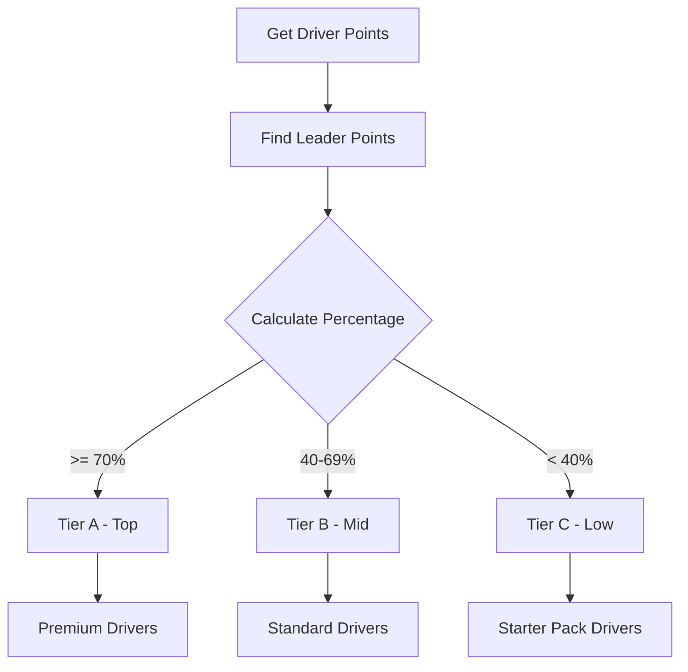

**Criterios de clasificación:**
- **Tier A**: ≥70% de los puntos del líder (pilotos top)
- **Tier B**: 40-69% de los puntos del líder (pilotos medios)
- **Tier C**: <40% de los puntos del líder (pilotos iniciales)

---

## 🔐 Validaciones y Reglas de Negocio

### Compra de Agente Libre
✅ Driver debe tener `owner_id = NULL`  
✅ Usuario debe tener presupuesto suficiente  
✅ Usuario no puede tener más de 4 drivers (3 lineup + 1 reserve)  

### Compra de Usuario
✅ Driver debe estar `is_listed_for_sale = True`  
✅ Driver NO debe estar bloqueado (`locked_until <= NOW()`)  
✅ Comprador debe tener presupuesto suficiente  

### Venta Rápida
✅ Usuario debe ser dueño del driver  
✅ Driver NO debe estar bloqueado (`locked_until <= NOW()`)  
✅ Usuario debe mantener **mínimo 3 drivers** (lineup completo)  
✅ Refund = 80% del `acquisition_price`  
⚠️ **Permite vender desde lineup o reserve** (decisión estratégica del usuario)

### Listar para Venta
✅ Usuario debe ser dueño del driver  
✅ Driver NO debe estar bloqueado (`locked_until <= NOW()`)  
✅ Usuario debe mantener **mínimo 3 drivers** (lineup completo)  
⚠️ **Permite listar desde cualquier posición** (lineup o reserve)  

### Buyout Clause
✅ Comprador debe tener presupuesto para 130% del precio  
✅ Víctima debe tener el driver en su team  
✅ Comprador debe tener slot de reserve disponible  
✅ Máximo 2 buyouts por par de usuarios por temporada  
✅ Driver va directamente a reserve del comprador (bloqueado 7 días)  

---

## 🚀 Próximas Implementaciones

### Sprint Actual
- [ ] Implementar mutations reales (actualmente console.log)
- [ ] Crear modales de confirmación (BuyDriverModal, SellDriverModal)
- [ ] Añadir TransactionResultModal para feedback
- [ ] Implementar filtros de mercado (All, Free, Owned, For Sale)
- [ ] Añadir sorting (Name, Price, Points)

### Futuro
- [ ] Sistema de pricing dinámico basado en demanda
- [ ] Actualización de `current_market_value` según transacciones
- [ ] Performance score automático según resultados
- [ ] Notificaciones de mercado en tiempo real
- [ ] Histórico de precios (gráficos)

---

## 📚 Referencias

### Archivos Frontend
- `frontend/src/hooks/market/useMarket.ts`
- `frontend/src/services/marketService.ts`
- `frontend/src/types/marketTypes.ts`
- `frontend/src/components/market/`
- `frontend/src/pages/MarketNew.tsx`

### Archivos Backend
- `f1_api/controllers/market_controller.py`
- `f1_api/routers/leagues_router.py`
- `f1_api/models/repositories/driver_ownership_repository.py`
- `f1_api/models/repositories/market_transactions_repository.py`
- `f1_api/models/repositories/buyout_clause_history_repository.py`
- `f1_api/models/lib/drivers_utility.py`

---

**Última actualización**: 21 de octubre, 2025  
**Versión**: 1.0.0  
**Autor**: Sistema de documentación automática
